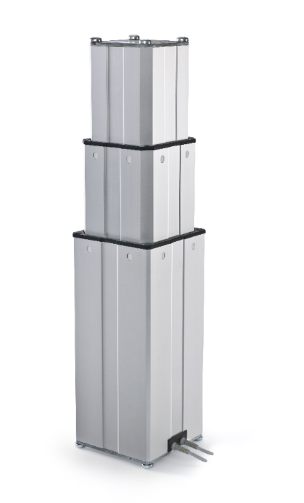

# Ewellix Lift Kit

ROS 2 hardware drivers for the [Ewellix TLT Lift Kit](https://www.ewellix.com/en/products/lifting-columns/tlt).
The drivers have been built and tested against ROS 2 humble.



## Build and Configure

To compile, add this repo to a colcon workspace, then install relevant ROS dependencies with `rosdep`.

The drivers communicate using a serial (RS232) connection, the port is configurable though the [com_port](./ewellix_liftkit_description/urdf/ewellix_lift.urdf.xacro) parameter.
Be sure that the [serial](https://github.com/tylerjw/serial.git) project is available either on the machine or in the same workspace.

Once all dependencies are installed, the drivers can be compiled with `colcon build`.

## Run

The deploy packages include launch files for both hardware and a kinematic simulation.
To launch the drivers:

```bash
# Run the kinematic simulation
ros2 launch ewellix_liftkit_deploy liftkit.launch.py use_fake_hardware:=true

# Run the hardware drivers
ros2 launch ewellix_liftkit_deploy liftkit.launch.py
```

We also include a basic MoveIt configuration for testing planning and execution.

```bash
ros2 launch ewellix_liftkit_moveit_config liftkit_moveit.launch.py
```

## A Note on Control

The liftkit motors are controlled solely through velocity commands, but the hardware interface ingests position commands.

The crux of the issue is that there is a minimum speed that can be sent to the motors such that the lift can be moved.
When you command too low of a speed, the robot will stop and you have to call `stop()` followed by `moveDown()` or `moveUp()` to start movement again.
This can cause some issues with movement, particularly when executing trajectories with slower velocities.
In many cases, the commanded final position of a trajectory will not be reached because the commanded motor speed towards the end is insufficient for movement.
It can also cause "stuttering" in the movement of the lift.

To improve both the tracking and steady state accuracy of the drivers, there are a few control principles that have been added to compensensate for the problems above,

1) A feedforward term to the controller so that we do not follow too far behind the commanded velocity and stop every time we get close.
2) An integral component so that we pick up the slack if trajectory starts are delayed due to the ramp up velocity commands.
3) We have separated the actuation of motor 1 and motor 2, which effectively cuts down the minimum speed by half.
