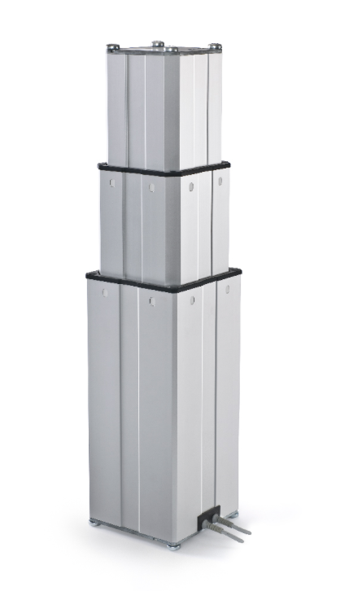

# Ewellix Lift Kit

ros2_control hardware drivers for the [Ewellix TLT Lift Kit](https://www.ewellix.com/en/products/lifting-columns/tlt) and [Elmo Gold motor controllers.](https://www.elmomc.com/product/gold-solo-twitter/) 


The drivers have been built and tested against ROS 2 Jazzy.

<div align="center">
  <figure>
    
  </figure>
  <figure>
    
  </figure>
</div>

# Overview 
This project provides a complete ros2_control system for the Ewellix actuator with dual Elmo Gold brushless servo motor controllers. The Elmo Gold controllers have many advantages that make development of a robotic system a lot easier and more precise. This is meant to be an expandable framework that can be adapted to different robotic systems.

This implementation provides:
- **Elmo Gold C++ API** - Includes Elmo commands for actuator control, with up to 2× the serial update rate of the previous implementation.
- **Dual-Motor Control** - For use with a two-motor actuator
- **Actuator Calibration** - Finds the endpoints of the actuator and encoder ranges
- **ros2_control Integration** - Full `ros2_control` framework support including RViz
- **Actuator and Controller Telemetry** - Monitoring of motor and controller status
- **Configurable Motion Profiles** - Tunable acceleration, deceleration, speed, and more
- **Serial Communication** - RS-232/USB via Elmo TLT protocol 
  
# Build and Configure
## Prerequisites 
- To run this, make sure you have [ROS 2](https://github.com/ros2) and [ros2_control](https://github.com/ros-controls/ros2_control) installed on your system. 

- Your user must have permission to access the serial devices (for example `/dev/ttyACM0` and `/dev/ttyACM1`). On Ubuntu, this typically requires membership in the `dialout` group.

  **Make sure to reboot for these changes to stick.**

```bash
sudo usermod -aG dialout $USER
```
- Clone of this Elmo branch on your system.
## Compile 

To compile, add this repo to a colcon workspace, then install relevant ROS dependencies with `rosdep`.

The drivers communicate using a serial (RS232) connection, the port is configurable though the [com_port](https://github.com/NASA-JSC-Robotics/ewellix_lift_kit/blob/elmo/ewellix_liftkit_deploy/config/ewellix_liftkit_parameters.yaml) parameter.

Once all dependencies are installed, the drivers can be compiled with `colcon build`.

# Run

The deploy packages include launch files for both hardware, kinematic simulation, homing procedures and actuator test files.

**Always home the Ewellix actuator as the Elmo controller does not remember the encoder position after a power loss.**

To launch the drivers:

```bash
# Source the workspace or add to your bashrc
source ~/ewellix_lift_kit/install/setup.bash

# Run the kinematic simulation
ros2 launch ewellix_liftkit_deploy liftkit.launch.py use_fake_hardware:=true

# Run the hardware drivers
ros2 launch ewellix_liftkit_deploy liftkit.launch.py use_fake_hardware:=false

# Run the homing procedure, the actuator will find min and max endpoints, detailed instructions below
ros2 run liftkit_hardware_interface elmo_calibration

or

cd ~/ewellix_lift_kit
./install/liftkit_hardware_interface/lib/liftkit_hardware_interface/elmo_calibration

```

We also include a basic MoveIt configuration for testing planning and execution.

```bash
ros2 launch ewellix_liftkit_moveit_config liftkit_moveit.launch.py
```

# Testing Movement
## Manual Movement Commands With ROS2
To manually move the lift to a certain height, you can use ROS2 commands directly through the command line like this:

```bash
ros2 topic pub /lift_position_controller/commands std_msgs/msg/Float64MultiArray "data: [0.4]"
```

**The 0.4 input can be changed to any height requested**

## Manual Movement Without ROS2
Since the Elmo motor controller library is abstracted, this allows you to write custom programs outside of ROS2 to control the Ewellix Liftkit. Example usage is shown below to control a single motor called elmoTop, but the same can be applied to multiple motors by instantiating the object:

```c++
// Step 1
elmoTop.connect(); // Will attempt to connect to motor controller currently connected via USB.

// Step 2
// Three different control modes can be set depending on your use case.     
elmoTop.setVelocityMode();
or
elmoTop.setPositionMode();
or
elmoTop.setCurrentMode();

// Step 3
// These motor parameters need to be set to use the motor controller, the number values can be changed as needed for the program. 
elmoTop.sendRawCommand("AC=100"); // Acceleration
elmoTop.sendRawCommand("DC=100"); // Deceleration
elmoTop.sendRawCommand("SD=100"); // Stop Deceleration (For emergency stops)
elmoTop.sendRawCommand("SP=100"); // Max Speed

// Step 4
// Now the motor can be armed and turned on, don't worry as the motor won't move without movement commands.
elmoTop.motorOn();

// Step 5
// Now the motor can be moved with movement commands and pinged for telemetry data. Shown below is movement with position mode:
elmoTop.setPositionRelative(400); // Moves relative to current position
or
elmoTop.setPosition(400); // Moves relative to home position

elmoTop.getPosition(); // Current motor position
elmoTop.getVelocity(); // Current motor velocity
elmoTop.getCurrent();  // Current draw

// Step 6
// After movement is completed, the Elmo controller can be turned off and disconnected.
elmoTop.stopMotion(); // Stops current motor motion, even in the middle of travel.
elmoTop.motorOff();   // Disarms motor.
elmoTop.disconnect(); // Disconnects serial connection
```

## Sine Wave Test With ROS2
We have included a sine wave input file to test the system's response to continuous motion commands. This can be run either manually or through ROS2 run as shown below:

```bash
# ROS2 run
ros2 run ewellix_liftkit_deploy sine_wave_test.py

# Python 3 if preferred
cd ~/ewellix_lift_kit/ewellix_liftkit_deploy/scripts

python3 sine_wave_test.py
```

The initial position is called for a short period to give time for the actuator to get to the initial location. You should see an output similar to this:

```bash
[INFO] [1784216765.527447886] [sine_wave_command_publisher]: Sine Wave Publisher Started
[INFO] [1784216765.527886482] [sine_wave_command_publisher]:   Phase 1: Hold at center (0.3m) for 10.0s
[INFO] [1784216765.528300202] [sine_wave_command_publisher]:   Phase 2: Sine wave - Center: 0.3m, Amplitude: 0.15m, Period: 40.0s
[INFO] [1784216765.532496222] [sine_wave_command_publisher]: [INIT] t=  0.02s | Cmd: 0.3000m | Actual: 0.0000m | Error: +0.3000m | Vel: 0.0000m/s
[INFO] [1784216765.554688388] [sine_wave_command_publisher]: [INIT] t=  0.04s | Cmd: 0.3000m | Actual: 0.0000m | Error: +0.3000m | Vel: 0.0000m/s
[INFO] [1784216765.576863294] [sine_wave_command_publisher]: [INIT] t=  0.07s | Cmd: 0.3000m | Actual: 0.0000m | Error: +0.3000m | Vel: 0.0000m/s
[INFO] [1784216765.599160171] [sine_wave_command_publisher]: [INIT] t=  0.09s | Cmd: 0.3000m | Actual: 0.0000m | Error: +0.3000m | Vel: 0.0000m/s
```

The sine wave test can be paired visually with a ROS2 plotting program like PlotJuggler that allows you to visually observe commands vs actual movement.

## Sine Wave Test Without ROS2

# How To Home Actuator With Elmo Controllers
The liftkits are not all made exactly the same (apparently).
There are small discrepancies that can result in a couple of mm of error, which we would like to avoid.
This calibration procedure allows you to take a couple of observations, and then let the driver do all of the math for you.

The parameters will automatically be saved to [this yaml](https://github.com/NASA-JSC-Robotics/ewellix_lift_kit/blob/elmo/ewellix_liftkit_deploy/config/ewellix_liftkit_parameters.yaml) when the procedure is ran. 

**All that is needed is a tape measure and a Linux machine running this repo with Elmo controllers.**

First, run the calibration command as shown above in the **Run** section. The type of output you should see is:
```sh
Loaded from URDF:
  port_top (first): /dev/ttyACM0
  port_bottom (second): /dev/ttyACM1

=== Connecting Motors ===
ACM2: 20210922 = bottomMotor
ACM3: 20210926 = topMotor

=== Calibrating DOWN ===
[topMotor] Moving...
[topMotor] VEL=0 POS=0
[topMotor] VEL=0 POS=0 ...
```

When the endpoints are reached, there will be a prompt to input in a height measurement **in meters**, for example here is the bottom:

```sh
=== DOWN Results ===
Top Motor:    OK - encoder zeroed
Bottom Motor: OK - encoder zeroed

Enter minimum height in meters: 
```


Measure from the same relative point (like the base) to the top of the actuator like shown below:


Do this for both the top and bottom when prompted, if measured at the same relative point the formula will scale properly.

When done, a sucessful output should appear and the data will be stored in [this yaml](https://github.com/NASA-JSC-Robotics/ewellix_lift_kit/blob/elmo/ewellix_liftkit_deploy/config/ewellix_liftkit_parameters.yaml)

## Citation

This project falls under the purview of the iMETRO project.
If you use this in your own work, please cite the following paper:

```bibtex
@INPROCEEDINGS{imetro-facility-2025,
  author={Dunkelberger, Nathan and Sheetz, Emily and Rainen, Connor and Graf, Jodi and Hart, Nikki and Zemler, Emma and Azimi, Shaun},
  booktitle={2025 22nd International Conference on Ubiquitous Robots (UR)},
  title={Design of the iMETRO Facility: A Platform for Intravehicular Space Robotics Research},
  year={2025},
  volume={},
  number={},
  pages={390-397},
  keywords={NASA;Moon;Seals;Maintenance engineering;Maintenance;Robots;Standards;Open source software;Testing;Logistics},
  doi={10.1109/UR65550.2025.11077983}}
```
